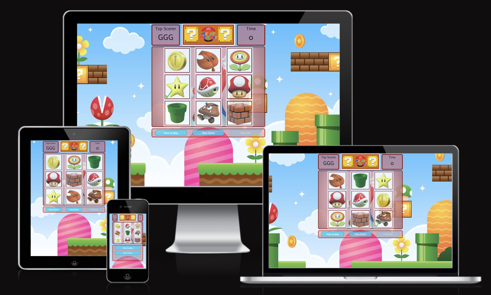

# **_Messy Memory Game_**

The Messy Memory game is not your typical memory game. It is different from the usual matching of 2 identical images to score. The objective of this game primarily is to remember the images and its position in a given time limit. This game is inspired from one of the mini-games in the popular Super Mario Party game. This memory game will test not only how sharp your brain is but also how quick you can be. This game is an enjoyable game to play and a very good exercise for your brain. If you are also a Super Mario fan, you will surely enjoy this game even more  as the website basically has a Super Mario theme/vibe, including the colours and characters. Clear instructions of how to play the game are also provided for the user's convenience. A difficulty level can also be set so users can choose how challenging the game they wanted to be. Explore and hope you this cool game at 

<a href="https://tineggarcia.github.io/messy-memory/index.html" target="_blank" rel="noopener">Messy Memory</a>

**[Live site](https://tineggarcia.github.io/baking-frenzy/index.html)**
------------------------------------------------------------------
**[Repository](https://github.com/tineggarcia/messy-memory)**
------------------------------------------------------------------

## Contents

* [**User Experience UX**](<#user-experience-ux>)
    *  [User Stories](<#user-stories>)
    * [Wireframes](<#wireframes>)
    * [Site Structure](<#site-structure>)
    * [Design Choices](<#design-choices>)
    *  [Typography](<#typography>)
    *  [Colour Scheme](<#colour-scheme>)
* [**Features**](<#features>)
    * [**Home**](<#navigation-menu>)
        * [Navigation menu](<#navigation-menu>)
        * [Welcome - Hero Section](<#welcome-hero-section>)
        * [Cake Products](<#cake-products>)
        * [About-us](<#about-us>)
        * [Testimonials](<#testimonials>)
        * [Footer](<#footer>)
        * [Gallery](<#gallery>)
        * [Sign up](<#sign-up-form>)
* [**Future Features**](<#future-features>)
* [**Technologies Used**](<#technologies-used>)
* [**Testing**](<#testing>)
* [**Deployment**](<#deployment>)
* [**Credits**](<#credits>)
    * [**Content**](<#content>)
    * [**Media**](<#media>)
*  [**Acknowledgements**](<#acknowledgements>)

# User Experience (UX)

* The main goal is to let the user test their Harry Potter knowledge.
* The user should have good insight in the content when viewing the startpage.
* The user should have an easy accesible button to start the quiz.
* The user should receive direct feedback on wheter the answer is correct or not.
* The user should have the possiblity to restart the quiz and try to improve.

## User Stories

* As a user I want to be able to straight away tell what is the website all about. 
* As a user I want the website to be inviting and will entice me to explore the website more.
* As a user I want to find what am I looking for through smooth and easy navigation.   
* As a user I want to be satisfied with the amount of information I have acquired from the website  or meets my expectation.
* As a user I want to understand the purpose of the website and what it has to offer upon loading it or just by few clicks. 
* As a user I want to be able to see the available items that are available for the consumer in the website. 
* As a user I want to enjoy navigating through the website and will keep my interest as I go through the site.
* As a user I want to be inspired get some idea by the photo gallery provided in the site.
* As a user I want the site to be able to help me in making my mind or pick the right one or at least choose a prospective one. 
* As a user I want that in the event that I couldn't find what I'm looking for in site, there will be a way to let the site owner know.
* As a user I want to be able to know the contact details and location of Baking Frenzy Cakes. 
* As a user I want to see the items I am looking for quickly through selections available in the website to avoid going through the entire site.
* As a user I want to see what people has to say about Baking Frenzy through the feedbacks or testimonials.
* As a user I want to be able to let the site know that I want to get updated of promos and news through signing up toe their newsletter.
* As a user I want to be able to have a quick link to see all the artists works and be inspired. 
* As a user I want to be able to connect or find out more through social media links. 
* As a user I want to be over-all satisfied with my experience with the website and will definitely be checking back again. 

[Back to top](<#contents>)

## Wireframes

I have used [Balsamiq](https://balsamiq.com) wireframes for Baking Frenzy Cakes wireframes. 
The frame provided was designed under a deskptop on full display. Changes of appearance 
for tablet and mobile is very minimal. Basically all the images will either just shift down 
one under the other or just sit side by side. Normally were displayed 1 per page so user 
can have a clear view. The initial plan/design drawn on wireframes was not 100% executed 
during the development as some issues/complications was considered along the way. 

[Back to top](<#contents>)

## Site Structure

Baking Frenzy Cakes website has Four(4) main pages such as Home, Products, Gallery and Sign up. 
The website initially loads the home page or landing page (index.html) which display a 
very nice hero image, a clear, vivid and mouth-watering image of cupcakes that is surely inviting
to the users. The page also displays a clear welcome message and Baking Frenzy Cake's motto.
From the Home page, navigation links on the upper right hand of the scree are always 
accessible and just a click away. Alongside the navigation links sits the Logo and Logo name
which helps the user in ensure be reminded that they are definitely in the correct 
website. At the bottom of the page, a footer is provided that contains all the social media 
links. The Home page is also divided into three(3) sections. The Welcome section, About section, 
and the Testimonials section. Details of each section will be discussed in the next sections.

[Back to top](<#contents>)
## Design Choices

* ### Typography
    I have chosen the 2 fonts for the project, Montserrat and Lora. This font pair was suggested 
by FontJoy website. Plus, I also would want to try out a new, artsy and modern look on fonts.
On some of my header text, I used them together side by side to create a modern and unique look.
  * 'Montserrat' is the primary font I used. I used it both in my headings and body texts. 
        This font in my opinion provides a neat and clear look that I believe is essential in 
        developing an effective and professional website. Montserrat might be thin but due to
        its spacing, users can easily read it. Throughout my development I opted to change the 
        text spacing by reducing the normal a bit to save space and provide a different look. 
  * 'Lora' cursive, is used to provide contrast to the main font and I think provides 
      a more feminine look which I believe suits well the site's colour 
      scheme. I also decided to use it since cursive usually is used to highlight some significant 
      content, to draw more attention to it. 
    
  * ### Colour Scheme
      I have chosen the following colour scheme various shades of pink and red as I think 
  most of the time cakes are associated with pink, as cakes normally adored (not only consumed)
  by ladies and girls. I chose red, not bright red though, but more of brownish red to add in 
  contrast to pink, also red is my personal favourite hence I included it. I may have used 
  different RGB colors but they all still fall on the same colour scheme, it may just look like 
  different at some point since I change the opacity for some to offer a more warm look.  I 
  steered away from vibrant and fun colours as I want to maintain a calm and warm atmosphere
  throughout the website.

[Back to top](<#contents>)

# Features

Baking Frenzy Cakes a very easy and enjoyable website, warm to the eyes and 
offers a lot of visual to give the users a better experience in choosing the 
cake they are looking for or even just to get an idea. Tremendous work is done
to provide a clear and appealing images/photos with a very minimal stretch/pixelation 
that can't be avoided in some circumstances. The website I believe will be 
enjoyable to the user, the mouth-watering cakes will urge the user to go to 
nearest cake/coffee shop to grab a slice of cake and a coffee. 

## Existing Features
* ### Navigation Menu
    
  * Located at the top of all the existing pages, this provides a quick link to all the
pages such as Home, About, Gallery and Sign-up. On the left hand corner sits the 
Baking Frenzy logo and logo name. Both can be clicked to link back to the home page.
Navigation bar was made using Flex for ease of manipulation. 

[Back to top](<#contents>)

* ### Welcome Hero Section
    * This hero section displays a decent sized image of scrumptious cupcakes that 
I find it really enticing for the users. A small reddish overlay was placed on top 
of the hero image, to create a bit of opacity to some parts of the image, plus 
it serves as the container frame for the Welcome text and the motto of Baking 
Frenzy. Located at the bottom of the screen, the cupcake icon serves as the 
shortcut to the Cake Products selection. 

* This fun animated cupcake icon is a shortcut to scroll down to the Cake Product 
types in the website. Users will be encouraged to click it being it animated and
the label "What are you looking for?" really gives the user a hint of the next action
that they could take, like clicking onto the cupcake icon to answer that question.
    

[Back to top](<#contents>)

* ### About Us
    * The About Us section lets displays some information like background/history
of Baking Frenzy Cakes, of what lad the start of it.  Lastly, the contact 
    * Just to be able to include a video element on the site, a short clip of 
baker frosting the cake is added and I think somehow entertains the user for a good
bit.
    * Also mentioned the award/distinction Baking Frenzy Cakes has received.
    * A photo of the entry to the competition was also placed to add some truth 
to what has been claimed to prove that such distinction did happen really. 
    * Address and Contact number can be found on this section too.  
    * Lastly I added an image of the map location to give the users an idea of the location.

[Back to top](<#contents>)

* ### Footer

    * Footer sits on the same background color as the header to keep consistency on the colour
scheme and design of the website.
    * The footer basiscally contains all Baking Frenzy Cake's social media accounts. Obviously 
each icon diverts the webpage that corresponds to the selected. 

[Back to top](<#contents>)

* ### Cake Products
  * This Cake Products page will open upon click/selection on the Cake Products section 
    on the Home page (see image below). Based on what was selected the cake products that 
    will be shown(scrolled to).
  * The Cake Products page contains all the available products but it's divided into different 
    section and grouped them for ease of navigation.
  * Both the Cake Products Type and the gallery of cakes selected by type are both grid for 
a very nice and even presentation of images plus ease of navigation. 
  
      * Choose from these 3 types of cakes.
  * 

  * Each cake item was presented equal in size to each other and shares the same colour and 
font for uniformity and a neat look.
  * This gallery could help the users to decide of what type of cake they might like and all the
possibilities.
  * To better help the user to identify the items, title and description was displayed. 

  * 
[Back to top](<#contents>)

* ### Testimonials
    *
    * The testimonials display the feedback previous customers have given Baking Frenzy Cakes.
    * Each testimonial shows the photo of the cake the customers have ordered plus their feedback.
    * I have included three(3) testimonials at the moment, which I believe are fair enough.
    * I have used a grid here to create these testimonials for easy layout and easy responsiveness.
    * I designed each testimonial in a box, with shadow look border to give a classy feel and provides
      emphasis on it.
    * Lora cursive font was used to represent texts as statements/phrases that were mentioned by a person.

[Back to top](<#contents>)

* ### Gallery
  * This page displays a collection of Baking Frenzy Cake's best works. 
  * This page could help the user to get an idea of what cake they might want.
  * The difference between this gallery and the Cake Products is that this gallery is merely
just images, unlike the other page wherein title and description of each was provided. 
  * This gallery was created using grid for better responsiveness.

[Back to top](<#contents>)

* ### Sign up Form
* 
    * This page provides the user an option to be updated and receive promotions, news and 
updates by allowing the users to store their contact details so they can be in the mailing list.
    * Also on this page, the user would confirm that they agree to Baking Frenzy Cake's 
privacy policies.

 
* This form only does validation of input fields at the moment and when user clicks on 
the Submit button, an acknowledgement message is displayed at the bottom (see image below).

[Back to top](<#contents>)

## Future Features

* An "Order" facility where users can purchase cakes online including add to cart and 
selection of delivery options.
* A facility to customise a cake based on some elements that will be provided. 
* A good selection of standard ready-made cakes would be great to have. 
* Some items like cake essentials like candles, toppers, boxes and packagings 
would be a good addition
* Flavour and size guide of cakes would give the user a better UX.

[Back to top](<#contents>)

# Technologies Used
* [HTML5](https://html.spec.whatwg.org/) - provides the content and structure for the website.
* [CSS](https://www.w3.org/Style/CSS/Overview.en.html) - provides the styling and layout for the HTML pages.
* [Balsamiq](https://balsamiq.com/wireframes/) - used to create the wireframes.
* [Gitpod](https://www.gitpod.io/#get-started) - used to deploy the website.
* [Github](https://github.com/) - used to host and edit the website.

[Back to top](<#contents>)

# Testing
*   Testing was mainly done by me and some other families and friends so will have some 
feedback across various devices. 

### HTML Validation

* HTML Testing results, NO ERRORS FOUND and cleared. 

* CSS Testing results, NO ERRORS FOUND and cleared.

[Back to top](<#contents>)

# Lighthouse Testing

* I am happy with the over-all performance based on the tests results. 
* I had a poor performance on the first few test attempts mostly because of the images so I have 
  to compress it and it made a big difference.
* See results on the images below, most of them 100% performance. 

[Back to top](<#contents>)

# Credits
### Content

* The font came from [Google Fonts](https://fonts.google.com/).
* For the pairing of the fonts I used [Fontjoy](https://fontjoy.com) .
* I compressed the images using [Tiny Img](https://tiny-img.com/webp).
* Most of the photos belongs to myself but I took a few from [Pexels](https://www.pexels.com/) 
  and [Unsplash](https://unsplash.com).
* The video used on the homepage is from [Pexels](https://www.pexels.com/).
* The embedded cupcake icon used from [Giphy.com](https://giphy.com/)
* The icons used came from [Font Awesome](https://fontawesome.com/)
* The Flex and CSS Grid was learned Geek for Geeks Youtube channel [YouTube tutorial](https://www.youtube.com/).
* I took some code examples from [Stack Overflow](https://stackoverflow.com/), [CSS-Tricks](https://css-tricks,com/)
* I also checked out [W3 Schools](http://w3schpols.com) to learn more about HTML and CSS.
* I used the [Balsamiq](https://balsamiq.com/wireframes/) for my wireframes.
* I used the [W3C Validator](https://validator.w3.org/) and [Jigsaw Validator](https://jigsaw.w3.org/css-validator) for my HTML and CSS code testings. 
* I used the Google Lighthouse for the Performance testing of my website.
* I also used [Brackets](https://brackets.io/) source code editor when I ran out of Gitpod hours and it
  was a weekend hence, no tutor care available.

[Back to top](<#contents>)

## Deployment

> To deploy the project I followed these steps starting from the main project repository 
>[here](https://github.com/tineggarcia/bakingfrenzy).

1. Clicked on `Settings` on the navigation menu in the repository
2. I then selected the `Pages` menu on the side bar.
3. In the first dropdown menu labeled `Source` I selected the branch of the name `main` from the dropdown.
4. In the next dropdown labeled `/root` I left as the default option.
5. Selected Save

> I then received a notification from GitHub that my project is being deployed and after about 1 minute & a couple of refreshes of the page it was ready and live.

[Back to top](<#contents>)

# Acknowledgements
The site was completed as a Portfolio 1 Project piece for the Full 
Stack Software Developer (e-Commerce) Diploma at the 
[Code Institute](https://codeinstitute.net/). As such I would like to thank 
my mentor [Precious Ijege](https://www.linkedin.com/in/precious-ijege-908a00168/),
the Slack community, our Cohort Facilitator Alan Bushell, my classmates, 
Code Institute Tutors and all at the Code Institute for their help  and 
support. Last but not the least, to my better half Neil for being so 100%
on board with me, rain or shine, always have supported and helped in any 
way he can. I couldn't have done this without him. 

Christine Garcia 2022

[Back to top](<#contents>)
