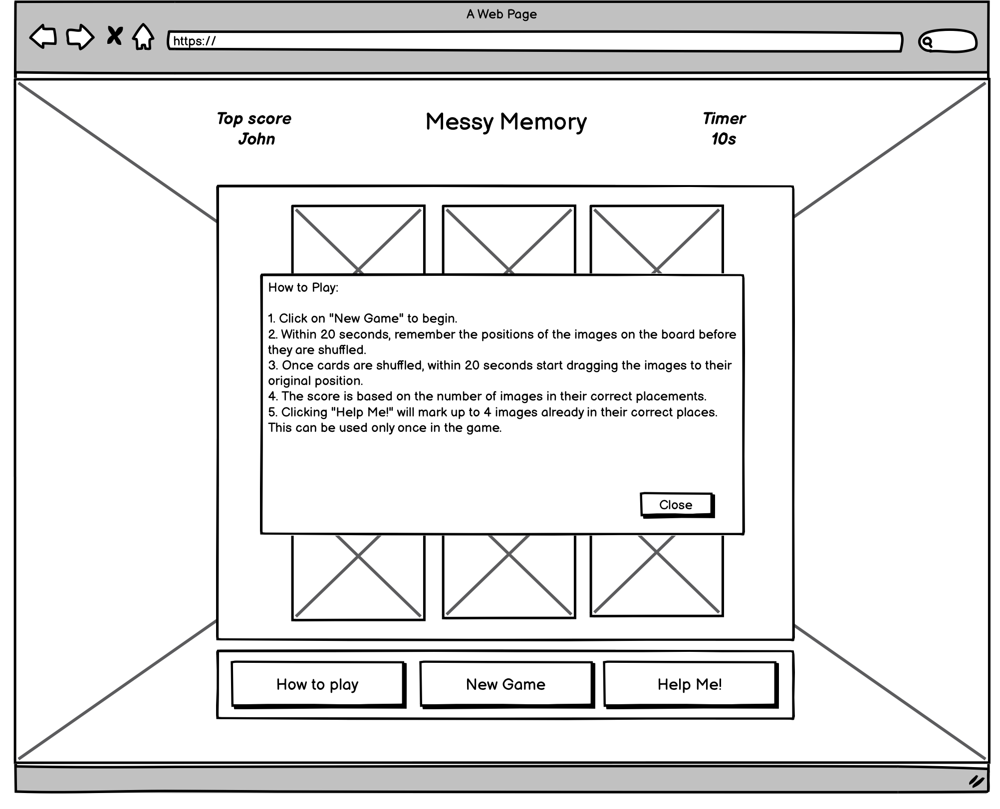
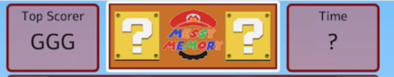

# *_Messy Memory Game_*

The Messy Memory game is not your typical memory game. It is different from the usual matching of 2 identical images to score. The objective of this game primarily is to remember the images and its position in a given time limit. This game is inspired from one of the mini-games in the popular Super Mario Party game. This memory game will test not only how sharp your brain is but also how quick you can be. This game is an enjoyable game to play and a very good exercise for your brain. If you are also a Super Mario fan, you will surely enjoy this game even more  as the website basically has a Super Mario theme/vibe, including the colours and characters. Clear instructions of how to play the game are also provided for the user's convenience. A difficulty level can also be set so users can choose how challenging the game they wanted to be. Explore and hope you this cool game at

<a href="https://tineggarcia.github.io/messy-memory/index.html" target="_blank" rel="noopener">Messy Memory</a>

*[Live site](https://tineggarcia.github.io/messy-memory/index.html)*

------------------------------------------------------------------

*[Repository](https://github.com/tineggarcia/messy-memory)*

------------------------------------------------------------------

## Contents

* [**User Experience UX**](<#user-experience-ux>)

    *  [User Stories](<#user-stories>)

    * [Wireframes](<#wireframes>)

    * [Site Structure](<#site-structure>)

    * [Design Choices](<#design-choices>)

    *  [Typography](<#typography>)

    *  [Colour Scheme](<#colour-scheme>)

* [**Features**](<#features>)

    * [**Home**](<#navigation-menu>)

        * [Navigation menu](<#navigation-menu>)

        * [Welcome - Hero Section](<#welcome-hero-section>)

        * [Cake Products](<#cake-products>)

        * [About-us](<#about-us>)

        * [Testimonials](<#testimonials>)

        * [Footer](<#footer>)

        * [Gallery](<#gallery>)

        * [Sign up](<#sign-up-form>)

* [**Future Features**](<#future-features>)

* [**Technologies Used**](<#technologies-used>)

* [**Testing**](<#testing>)

* [**Deployment**](<#deployment>)

* [**Credits**](<#credits>)

    * [**Content**](<#content>)

    * [**Media**](<#media>)

*  [**Acknowledgements**](<#acknowledgements>)

# User Experience (UX)

## User Stories

* The main goal is to test the users memory thru critical thinking and their ability to remember and recall information, and to make it challenging, a time limit is set.
* As a user, upon loading of the website, he/she will be able to have at least a tiny bit of idea of what the game is all about, that's the idea of the game being straightforward and intuitive.
* As a user, I want the website to be interesting and inviting for me and will entice me to start a new game.
* As a user, I want the website/game to be colourful and lively to look at and include clear and nice images.
* As a user and a fan or aware of the popular Super Mario game, can relate to the theme, when it comes to colours, background, images and even texts.
* As a user, read a brief and simple description of the mechanics of the game.
* As a user,  I should have easy access to starting a new game.
* As a user, be able to see the top scorer recorded.
* As a user should be able to get feedback on the correct and incorrect answers.

* As a user, the game must clearly indicate/show when the game has begun.

* As a user, during the game, be able to know the time remaining to solve the game.

* As a user, I should be notified of scores on the game.

* As a user I want to be over-all satisfied with my experience with the game website  and will definitely be checking back again.

[Back to top](<#contents>)

## Wireframes

I have used [Balsamiq](https://balsamiq.com) wireframes for the Messy Memory wireframes. I have created wireframes both for desktop and mobile display. For a tablet, it would be more likely the same as a desktop only reduced in size.

The frame provided was designed under a desktop on full display. Changes of appearance

for tablet and mobile is very minimal. Basically all the images will either just shift down

one under the other or just sit side by side. Normally were displayed 1 per page so user

can have a clear view. The initial plan/design drawn on wireframes was not 100% executed

during the development as some issues/complications were considered along the way.

WIREFRAME FOR DESKTOP

* Landing Page - This is the page that will be displayed upon loading of the website. It will show a pop-up window displaying the Instructions on how to play the game. A Close button can be found at the bottom to close the popup when you're done reading it.

* New Game Page - This page will be loaded upon starting a New Game, the game provides 9 images/card and with 20 seconds time limit both for memorising the images and rearranging them back to its original position.

WIREFRAME FOR MOBILE DEVICE

[Back to top](<#contents>)

## Site Structure

The Messy Memory Game Website has a very straightforward and intuitive design to ensure user's ease of use. The website contains 1 main page which is the main page(index.html) where the game area is located.

The website initially loads the home page or landing page (index.html) which opens up to a very vibrant, colourful Super Mario game background. Any Super Mario fanatic will definitely recognise the popular background even from afar and it will definitely entice them to explore the website more and get on the game. On top of the main page, the Top Scorer, the logo and name of the game website and Timer was placed. Underneath it, one will see the Game Area, where users can drag and drop the images to its original  position.

Below the game area, three (3) buttons are provided to be used by the user. They are How to Play, New Game and lastly the Help Me!

* How to Play - instructions on how to play the game.
* New Game - obviously starts a new game.
* The Help Me! - this gives the user a maximum of 5 hint of cards/ images already in the right position, a checkmark will be displayed for correct cards.

[Back to top](<#contents>)

## Design Choices

* ### Typography

    * I have chosen the font Alef for my project. This font in my opinion provides a neat and clear look that I believe is essential in developing an effective, nice looking yet fun game.

    * Specifically for the logo, I have used a customised Super Mario 265 font from the Dafonts. This has a very close likeness to the original Super Mario Bros. game font. I have observed that this font is being used by many designers in their websites that is related to Super Mario game.

* ### Colour Scheme

  I have chosen to use the colour Red and some Brown for the game. These colour combination provides calm and warm and can easily be seen over a very vibrant and colourful Super Mario themed background, which offers a variety of bright colours. Both colours are actually inspired by Super Mario's theme colour.

## Images/Stock photos

Landing First Time

Landing Subsequent

New Game

Re-arrange Start

Score is Low

Score is Decent

Perfect Score

* Top Scorer
* Logo and Game Name
* Timer

* Game Area
  

* Buttons selections
  

[Back to top](<#contents>)

## Future Features

* The original design was to have 2 levels of difficulty - Easy and Hard and it would be good to incorporate in the future.

* Have a Hidden level that will be enabled only if all puzzles are solved.

[Back to top](<#contents>)

# Technologies Used

* Javascript

* Framework Bootstrap

* [HTML5](https://html.spec.whatwg.org/) - provides the content and structure for the website.

* [CSS](https://www.w3.org/Style/CSS/Overview.en.html) - provides the styling and layout for the HTML pages.

* [Balsamiq](https://balsamiq.com/wireframes/) - used to create the wireframes.

* [Gitpod](https://www.gitpod.io/#get-started) - used to deploy the website.

* [Github](https://github.com/) - used to host and edit the website.

[Back to top](<#contents>)

# Testing

*   Testing was mainly done by me and some other families and friends so will have some

feedback across various devices.

### HTML Validation

* HTML Testing results, NO ERRORS FOUND and cleared.

* CSS Testing results, NO ERRORS FOUND and cleared.

* Javascript Testing results, NO ERRORS FOUND and cleared.

### Enhancement/Issues Found and Closed before Submitting Project

[Back to top](<#contents>)

# Credits

### Content

* The font came from [Google Fonts](https://fonts.google.com/).

* I used some Supermario images from Veezty, Pixabay, Unsplash.

* I took some code examples from [Stack Overflow](https://stackoverflow.com/), [CSS-Tricks](https://css-tricks,com/)

* I also checked out [W3 Schools](http://w3schpols.com) to learn more about HTML and CSS.

* I used the [Balsamiq](https://balsamiq.com/wireframes/) for my wireframes.

* I used the [W3C Validator](https://validator.w3.org/) and [Jigsaw Validator](https://jigsaw.w3.org/css-validator) for my HTML and CSS code testings.

* I used the [jshint Validator](https://jshint.com/) Javascript code testings.

[Back to top](<#contents>)

## Deployment

To deploy the project I followed these steps starting from the main project repository

[here](https://github.com/tineggarcia/messy-memory).

1. Clicked on Settings on the navigation menu in the repository

2. I then selected the Pages menu on the side bar.

3. In the first dropdown menu labeled Source I selected the branch of the name main from the dropdown.

4. In the next dropdown labeled /root I left as the default option.

5. Selected Save

[Back to top](<#contents>)

# Acknowledgements

The site was completed as a Portfolio 2 Project piece for the Full

Stack Software Developer (e-Commerce) Diploma at the

[Code Institute](https://codeinstitute.net/). As such I would like to thank

my mentor [Precious Ijege](https://www.linkedin.com/in/precious-ijege-908a00168/),

the Slack community, our Cohort Facilitator Alan Bushell, my classmates,

Code Institute Tutors and all at the Code Institute for their help  and

support. Last but not the least, to my better half Neil for being so 100%

on board with me, rain or shine, always have supported and helped in any

way he can. I couldn't have done this without him.

Christine Garcia 2023

[Back to top](<#contents>)